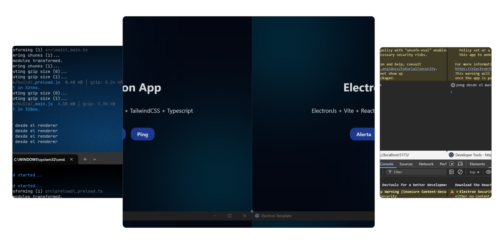

# Electron Vite Forge Template



Plantilla base para crear aplicaciones de escritorio con **Electron**, usando **Electron Forge** junto con **Vite** para un desarrollo moderno y rápido. Integra además **React**, **TypeScript** y **TailwindCSS**, ideal para proyectos modernos con una configuración lista para producción.

## 🚀 Tecnologías usadas

- [Electron](https://www.electronjs.org/)
- [Electron Forge](https://www.electronforge.io/)
- [Vite](https://vitejs.dev/)
- [vite-plugin-electron](https://github.com/electron-vite/vite-plugin-electron)
- [React](https://reactjs.org/)
- [TypeScript](https://www.typescriptlang.org/)
- [TailwindCSS](https://tailwindcss.com/)

---

## 📦 Instalación

1. Clona este repositorio:

```bash
git clone https://github.com/brionex/electron-app-template.git
cd electron-app-template
```

2. Instala las dependencias:

```bash
npm install
```

---

## 💻 Comandos disponibles

| Comando            | Descripción                                                                  |
| ------------------ | ---------------------------------------------------------------------------- |
| `npm run dev`      | Inicia la aplicación en modo desarrollo con recarga en caliente.             |
| `npm run package`  | Empaqueta la aplicación sin generar un instalador.                           |
| `npm run make`     | Genera una versión instalable de la aplicación para tu sistema operativo.    |
| `npm run app`      | Ejecuta la aplicación empaquetada para probarla en un entorno de producción. |
| `npm run publish`  | Publica la aplicación (requiere configuración previa).                       |
| `npm run lint`     | Ejecuta ESLint para detectar errores y aplicar buenas prácticas de código.   |
| `npm run lint:fix` | Corrige automáticamente los errores de lint que pueden resolverse.           |

---

## 🧠 Estructura del proyecto

```bash
📁 src/                          # Código fuente de la aplicación
│
├── 📁 main/                    # Proceso principal de Electron
│   ├── main.ts                # Punto de entrada del proceso main
│   ├── 📁 config/             # Configuración de la aplicación y ventanas
│   │   ├── setup.ts           # Inicialización general de Electron
│   │   └── window.ts          # Configuración y creación de la ventana principal
│   ├── 📁 ipc/                # Canales IPC (main ↔ renderer)
│   │   └── api.ipc.ts         # Registro y manejo de IPC handlers
│   ├── 📁 services/           # Servicios del proceso main
│   │   └── ping.ts            # Servicio de ejemplo (ping)
│   └── 📁 lib/                # Lógica compartida del proceso main
│       └── api.ts
│
├── 📁 preload/                # Preload (puente seguro entre main y renderer)
│   └── _preload.ts            # Exposición controlada de APIs al renderer
│
├── 📁 renderer/               # Interfaz de usuario (Vite + React)
│   ├── index.html             # HTML base
│   ├── main.tsx               # Entrada principal de React
│   ├── 📁 views/              # Vistas principales
│   │   └── App.tsx            # Componente raíz
│   ├── 📁 components/         # Componentes reutilizables
│   │   └── Button.tsx
│   ├── 📁 services/           # Servicios del renderer (IPC / lógica cliente)
│   │   └── index.ts
│   └── 📁 styles/             # Estilos globales
│       └── global.css
│
├── 📁 shared/                 # Código compartido entre procesos
│   └── 📁 types/
│       └── api.type.ts        # Tipos compartidos (IPC / contratos)
│
📁 resources/                  # Recursos estáticos
├── icon.ico
└── icon.png

📁 docs/                       # Documentación y assets
└── banner.svg

forge.config.ts               # Configuración de Electron Forge
package.json                  # Dependencias y scripts
eslint.config.js              # Configuración de ESLint
tsconfig.json                 # Configuración base de TypeScript
vite.*.config.ts              # Configuración de Vite por proceso
```

## 📤 Publicación

Este template incluye soporte para `electron-forge publish`. Puedes configurar el destino (GitHub Releases, S3, etc.) en tu archivo `forge.config.ts`. Más información aquí:
👉 [https://www.electronforge.io/config/publishers](https://www.electronforge.io/config/publishers)

---

## 📄 Licencia

Este proyecto está licenciado bajo la licencia [MIT](LICENSE).

---

## 🙌 Créditos

Este template fue creado para facilitar el desarrollo de aplicaciones de escritorio modernas, combinando lo mejor del ecosistema web y Electron.

Si tienes ideas de mejora, detectas errores o deseas proponer nuevas funcionalidades, no dudes en abrir un issue o enviar un mensaje a través de GitHub. Toda contribución es bienvenida y ayuda a mejorar el proyecto.
